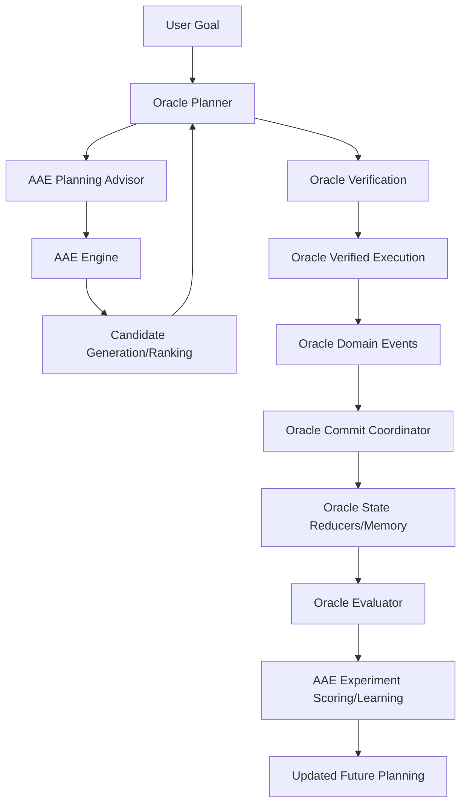

# Oracle-AAE Fusion Build Plan

## Executive Summary

This plan outlines the systematic integration of Oracle OS (Swift runtime) with the AAE Engine (Python) to create a unified autonomous software engineering system with clear authority boundaries.

### Current State Assessment

**Oracle Side (Integration files present):**
- `OracleAAEBridgeClient.swift` - HTTP client for AAE communication
- `OracleAAEBridgeConfig.swift` - Bridge configuration
- `OracleAAEExperimentCoordinator.swift` - Experiment coordination
- `OracleAAEModels.swift` - Data models for bridge
- `OracleAAEPlanningAdvisor.swift` - Planning advisor

**AAE Side (Bridge files present):**
- `contracts.py` - Request/response schemas
- `service.py` - Bridge service implementation
- `routers/oracle.py` - API endpoint

**Configuration:**
- `oracle_aae_bridge.json` - Bridge config (base_url, endpoint, timeout)

---

## Target Architecture



**Authority Split (Intentionally Maintained):**
- **Oracle**: Owns side effects, execution, verification, commit coordination
- **AAE**: Owns candidate search, localization, scoring, experiment logic

---

## Phase 1: Make the Boundary Strict

### Objective
AAE may return only structured candidates, never executable host-side effects.

### Allowed AAE Returns
- Candidate metadata
- Repository localization hints
- File targets
- Suggested commands in Oracle's internal command vocabulary
- Predicted scores
- Evaluation hints

### Prohibited AAE Returns
- Raw shell commands
- Direct host-executable strings

### Implementation Tasks

#### 1.1 Create Candidate Schema Documentation
Create `docs/candidate_schema.md` defining:
- `candidate_kind` enum values
- `tool_name` allowed values
- `safety_class` classifications
- Required fields: `rationale`, `confidence`, `safety_class`

#### 1.2 Create Oracle Candidate Validator
Create `OracleAAECandidateValidator.swift`:
- Decode only supported candidate kinds
- Reject unknown tool names
- Reject candidates with missing fields
- Map remote candidate types to Oracle-local command types

#### 1.3 Update AAE Contracts
Update `contracts.py`:
- Add explicit enums for candidate types
- Validate schema at API boundary
- Reject malformed candidates early

---

## Phase 2: Normalize Planning Authority

### Objective
Oracle remains the planner of record; AAE only advises.

### Decision Rules
Oracle chooses from three sources:
1. **Internal strong plan** - oracle_native
2. **Graph-backed plan** - oracle_graph  
3. **AAE advisory candidates** - aae_advised

Oracle should prefer AAE when:
- Task is code-heavy
- Internal plan confidence is weak
- Repo target is uncertain
- Evidence of repair/localization work

### Implementation Tasks

#### 2.1 Update PlannerDecision.swift
Add fused scoring formula:
```
final_score = 
  oracle_confidence_weighted_score
  + aae_predicted_score_weighted
  + target_path_match_bonus
  + safety_bonus
  - ambiguity_penalty
```

#### 2.2 Update TaskContext.swift
Add plan-source markers:
- `oracle_native`
- `oracle_graph`
- `aae_advised`
- `oracle_aae_hybrid`

#### 2.3 Add Domain Events
Create events for AAE interactions:
- `AAEAdviceRequested`
- `AAEAdviceReceived`
- `AAECandidateAccepted`
- `AAECandidateRejected`

#### 2.4 Update Planning Advisor
Enhance `OracleAAEPlanningAdvisor.swift`:
- Formal merge scoring
- Deterministic tie-breaking
- Candidate rejection reasons
- Source tagging

---

## Phase 3: Carry Target-Path Intelligence

### Objective
AAE workspace-relative path hints survive from plan to skill execution.

### Implementation Tasks

#### 3.1 Propagate Path Hints
Ensure these fields persist through the chain:
- Target file
- Ranked fallback paths
- Recommended test command
- Dominant language
- Patch file count limit

Files to update:
- `OracleAAEModels.swift`
- `TaskContext.swift`
- `ExecutionCoordinator.swift`
- `CodeSkillSupport.swift`

#### 3.2 Skill Behavior
`CodeSkillSupport.swift` should:
- Prioritize AAE target path when present
- Fall back to Oracle code query if path doesn't exist
- Emit path-resolution event
- Refuse broad mutation if path targeting available

---

## Phase 4: Make Experiment Results First-Class

### Objective
Oracle execution feeds back into AAE evaluation.

### Implementation Tasks

#### 4.1 Extend Experiment Coordinator
Update `OracleAAEExperimentCoordinator.swift`:
- Package execution outcomes:
  - Command executed
  - Touched files
  - Test results
  - Build results
  - Runtime diagnostics
  - Domain-event summary
  - Safety violations
  - Elapsed time

#### 4.2 Add AAE Result Endpoint
Create `result_contracts.py`:
- POST /api/oracle/experiment_result endpoint

Create `result_service.py`:
- Score the attempt
- Classify failure mode
- Record repair usefulness
- Update candidate ranking priors
- Return feedback summary

---

## Phase 5: Bounded Experiment Loop

### Objective
Reproducible, budgeted repair loop instead of one-shot advisory planning.

### Configuration Controls
- `max_candidates_per_goal`
- `max_execution_attempts`
- `max_patch_files`
- `max_total_runtime_seconds`
- `max_failed_attempts_before_abort`

### Implementation Tasks

#### 5.1 Update Bridge Config
Extend `oracle_aae_bridge.json`:
```json
{
  "max_candidates_per_goal": 5,
  "max_execution_attempts": 3,
  "max_patch_files": 3,
  "max_total_runtime_seconds": 300,
  "max_failed_attempts_before_abort": 2
}
```

#### 5.2 Implement Loop Controller
Oracle maintains loop control; AAE supplies ranked alternatives.

---

## Phase 6: Unify Observability

### Objective
Every AAE interaction visible in Oracle traces and vice versa.

### Implementation Tasks

#### 6.1 Oracle Trace Fields
- Bridge request ID
- Goal ID
- AAE engine version
- Candidate ID
- Selected candidate source
- Execution result
- Final plan score
- Rejection reason

#### 6.2 AAE Logging
- Request payload hash
- Repo profile
- Returned candidates
- Ranking scores
- Result-ingestion summaries
- Failure classifications

#### 6.3 Dashboard Panel
Create fusion panel in `aae-engine/dashboard`:
- Incoming Oracle goals
- Candidate rankings
- Accepted vs rejected
- Test pass rate
- Score lift from AAE advice
- Fallback frequency to Oracle-native

---

## Phase 7: End-to-End Test Matrix

### Test Layers

#### 7.1 Contract Tests
**AAE:**
- Malformed request rejected
- Unknown candidate kind rejected
- Missing repo path handled
- Empty candidate list handled

**Oracle:**
- Decode failures
- Unsupported tool mapping
- Confidence edge cases
- Fallback when bridge unavailable

#### 7.2 Integration Tests
With mocked AAE server:
- AAE suggests better target file
- AAE returns low-confidence candidates
- AAE times out
- AAE returns malformed payload
- Oracle native plan outranks AAE
- AAE plan outranks weak Oracle

#### 7.3 End-to-End Repair Tests
Using `aae-engine/benchmarks/cases`:
- Fix failing Python test
- Localize broken import
- Patch config bug
- Narrow flaky assertion

#### 7.4 Failure-Mode Tests
- Bridge down
- Slow bridge
- Partial candidate corruption
- Path mismatch
- Recommended test command fails
- Oracle verification rejects all candidates

---

## Phase 8: Deployment Topology

### Current (Preferred First Deployment)
```
Oracle (macOS app/runtime)
    ↔ localhost HTTP
AAE (Python service on port 8787)
```

### Future (After Contract Stabilizes)
```
Oracle (macOS)
    ↔ Internal Network/HTTP
AAE (Linux sidecar or remote service)
```

---

## File-by-File Upgrade Map

### Oracle Files to Strengthen

| File | Additions |
|------|-----------|
| `OracleAAEBridgeConfig.swift` | timeout, retry count, circuit breaker, max candidates, experiment budget, fallback policy |
| `OracleAAEBridgeClient.swift` | request id propagation, timeout handling, typed error classes, retry diagnostics |
| `OracleAAEPlanningAdvisor.swift` | formal merge scoring, deterministic tie-breaking, rejection reasons, source tagging |
| `TaskContext.swift` | selected candidate id, candidate source, target path hints, experiment budget, recommended test command |
| `ExecutionCoordinator.swift` | path-hint propagation, event emission, experiment result packaging |
| `CodeSkillSupport.swift` | candidate path ranking, fallback resolution, mutation scope limiting |
| `PlannerDecision.swift` | fused plan scoring metadata, reason trace, origin marker |

### AAE Files to Strengthen

| File | Additions |
|------|-----------|
| `contracts.py` | Hardened schema with version |
| `service.py` | Repo-language profiling, stronger localization, bounded candidates, ranked file targets |
| `routers/oracle.py` | Result-ingestion endpoint, versioned paths, explicit error payloads |
| `test_oracle_bridge.py` | Timeout, malformed candidates, empty repo, patch limits, ranking quality |

---

## Acceptance Criteria

### Build/Runtime
- [ ] AAE service starts cleanly
- [ ] Oracle builds on macOS
- [ ] Oracle runs with bridge enabled and disabled

### Planning
- [ ] Oracle logs when AAE was consulted
- [ ] Oracle rejects malformed AAE responses safely
- [ ] Oracle falls back cleanly when bridge unavailable

### Execution
- [ ] AAE cannot directly trigger side effects
- [ ] Oracle carries target-path hints into code skills
- [ ] Oracle emits durable events for accepted/rejected candidates

### Evaluation
- [ ] Oracle sends structured experiment outcomes to AAE
- [ ] AAE returns scored feedback
- [ ] Future candidate ranking improves based on prior results

### Observability
- [ ] One goal ID traceable across both systems
- [ ] Dashboards expose candidate quality and execution success

### Safety
- [ ] Retries bounded
- [ ] Candidate budgets enforced
- [ ] Patch scope capped
- [ ] Unsafe/unknown tool kinds rejected

---

## Execution Order

1. ~~Freeze baseline and verify Oracle on macOS~~ (already done - files exist)
2. **Harden schema and candidate validation** ← START HERE (Phase 1+2)
3. Normalize planner merge logic
4. Preserve target-path hints through execution
5. Add Oracle domain events for AAE interactions
6. Add experiment-result return path to AAE
7. Build bounded multi-candidate loop
8. Expand integration and end-to-end tests
9. Add dashboard visibility
10. Tune heuristics and scoring

---

## What NOT to Do

- ❌ Let AAE execute shell commands on host directly
- ❌ Duplicate Oracle verification logic inside AAE
- ❌ Let raw HTTP payloads leak into execution without normalization
- ❌ Add more planners
- ❌ Mix evaluation state into ad hoc logs instead of events
- ❌ Rely on confidence scores without recording why a candidate won